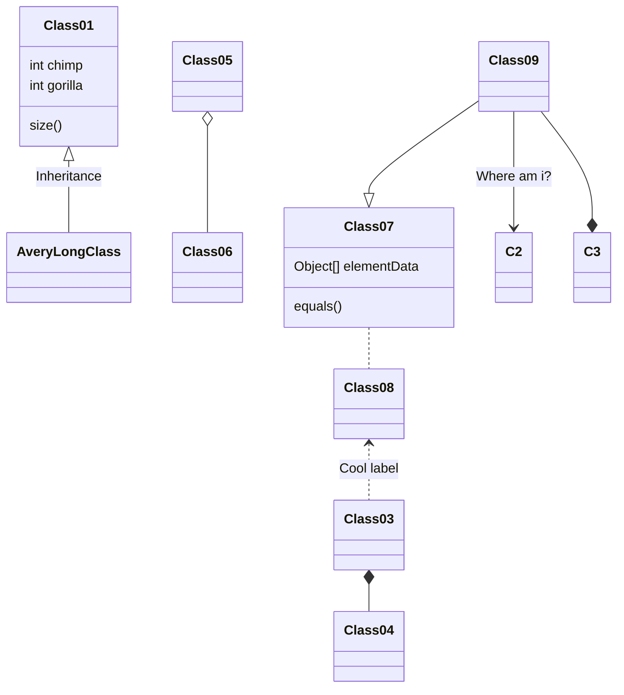
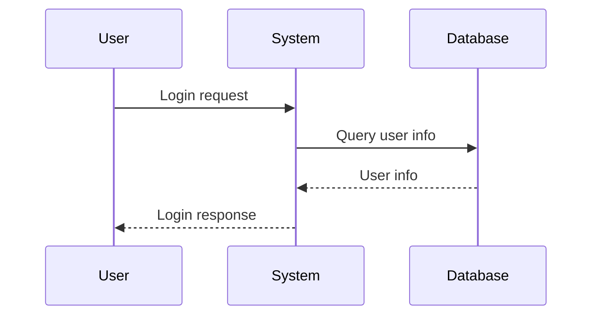

```mermaid
classDiagram
    Class01 <|-- AveryLongClass : Inheritance
    Class03 *-- Class04
    Class05 o-- Class06
    Class07 .. Class08
    Class09 --> C2 : Where am i?
    Class09 --* C3
    Class09 --|> Class07
    Class07 : equals()
    Class07 : Object[] elementData
    Class01 : size()
    Class01 : int chimp
    Class01 : int gorilla
    Class08 <.. Class03 : Cool label
```

```mermaid
sequenceDiagram
    participant U as User
    participant S as System
    participant D as Database
    
    U->>S: Login request
    S->>D: Query user info
    D-->>S: User info
    S-->>U: Login response
```
